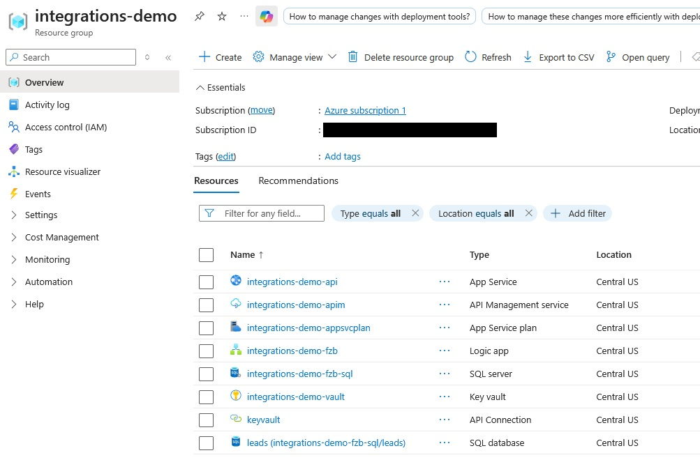
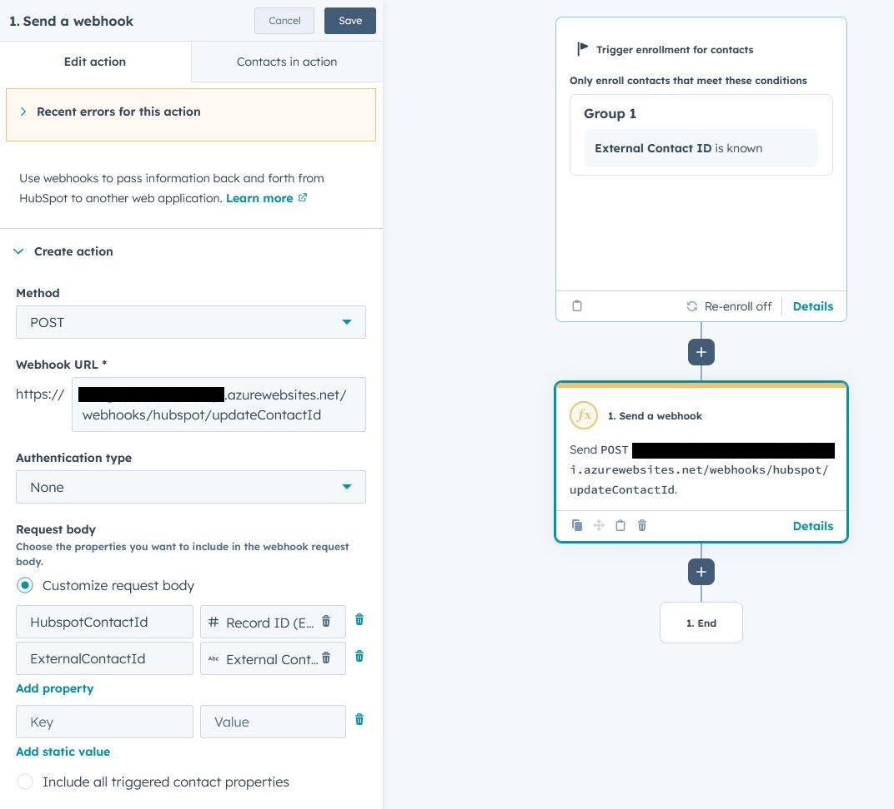
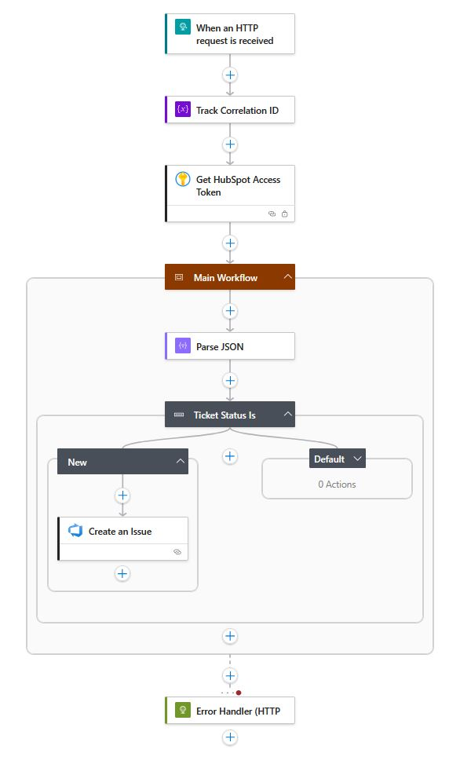
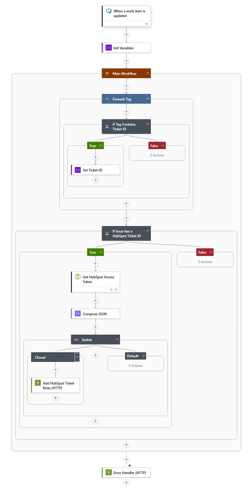

[](https://github.com/foozbat/dotnet-integrations-demo/actions/workflows/ci.yml)
[](https://github.com/foozbat/dotnet-integrations-demo/actions/workflows/deploy-to-azure.yml)
[](https://foozbat.github.io/dotnet-integrations-demo/)

# .NET Integrations Demo

A real-world cloud integration platform demonstrating modern API-first architecture with multi-channel customer engagement workflows. This project showcases seamless integration between CRM systems, notification services, and cloud automation tools.

### 📚 **[View Full Documentation →](https://foozbat.github.io/dotnet-integrations-demo/)**

---

## Tech Stack

### Backend
- **.NET 10** - ASP.NET Core Web API with minimal APIs.
- **Swagger/OpenAPI** 
- **Entity Framework Core 10**
- **Azure SQL Database**

### Integration & Automation
- **Azure Logic Apps** - Serverless workflow orchestration
  - API → HubSpot/Stripe/Zapier (user signup)
  - HubSpot → Azure DevOps (ticket sync)
  - Azure DevOps → HubSpot (status updates)
- **Azure Key Vault** - Secure secret storage
- **HubSpot CRM** - Contact and ticket management
- **Azure DevOps** - Work item tracking
- **Stripe** - Payment processing
- **Zapier** - Multi-channel notifications (SendGrid, Twilio, Slack)
- **Sentry** - Error monitoring and alerting

### DevOps
- **GitHub Actions** - CI/CD pipeline
- **Azure App Service** - PaaS hosting

## Architecture

### User Signup Flow
```
Client (Postman / Swagger)
    ↓
ASP.NET Core API (Create User)
    ├── Validate and Save User to Azure SQL DB
    └── Trigger Azure Logic App (Webhook)
         ├── HubSpot CRM
         │   ├── Create/Update Contact (with external_contact_id)
         ├── Stripe (if paid plan)
         │   └── Create Checkout Session
         └── Zapier Webhook
             ├── Email (SendGrid) with checkout link
             ├── SMS (Twilio)
             └── Slack Notification

User Clicks Payment Link
    ↓
Stripe Checkout (Payment Complete)
    └── ASP.NET Core API (Stripe Webhook)
         ├── Validate Stripe Request
         └── Update User.StripeCustomerId, User.StripeSubscriptionId in Azure SQL DB
```

### HubSpot ↔ Azure DevOps Bidirectional Sync
```
HubSpot Ticket Created
    ↓
Hubpot Workflow
    └── Azure Logic App (Webhook)
         └── Create Azure DevOps Issue (tagged: HubSpotTicket-{id})

Azure DevOps Issue Closed
    ↓
Azure Logic App (Polling)
    └── Add Note to HubSpot Ticket ("Issue resolved by developers")
```

## Design Decisions
- Logic Apps used for long-running and fan-out workflows
- API remains stateless and focused on validation + persistence
- External systems isolated behind workflow boundaries
- Bidirectional sync via tag-based linking (HubSpot ↔ DevOps)
- Sentry integration for error tracking across all workflows

### Workflow Visualizations (click to expand graphics)

<details>
<summary>Azure Resources</summary>


</details>

<details>
<summary>Create User Logic Apps Workflow</summary>


</details>

<details>
<summary>HubSpot ↔ Azure DevOps Sync</summary>

### HubSpot → DevOps
1. Webhook trigger from HubSpot ticket creation:



2. Creates Azure DevOps Issue with `HubSpotTicket-{id}` tag:



### DevOps → HubSpot
1. Polls Azure DevOps for work item updates
2. Adds note to HubSpot ticket when issue resolved



</details>

<details>
<summary>Zapier Integration Workflow</summary>


</details>

## Future Enhancements
- Expand DevOps sync to handle more ticket states
- Implement retry policies with exponential backoff
- Add rate limiting and request throttling