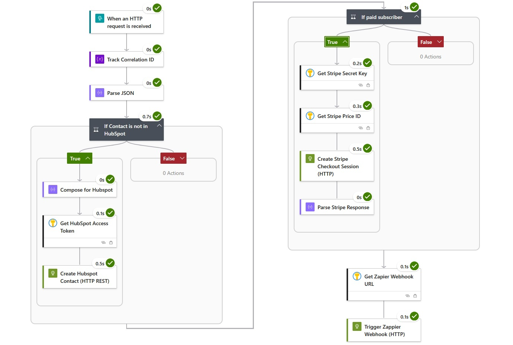
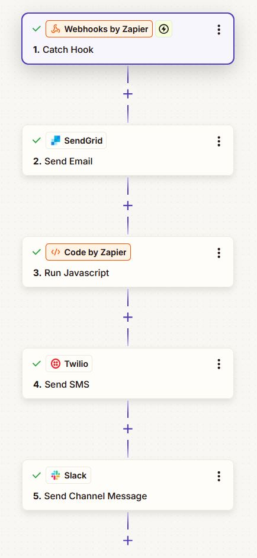

The **api-to-services** Logic App orchestrates the complete user signup workflow, integrating HubSpot CRM, Stripe payments, and Zapier notifications. This serverless workflow handles fan-out operations while keeping the API stateless and focused on validation.





## Overview

When a new user signs up through the API, this Logic App:

1. **Creates or updates HubSpot contact** with bidirectional ID mapping
2. **Generates Stripe checkout session** (for paid plans)
3. **Triggers Zapier webhook** for multi-channel notifications (email, SMS, Slack)

This fan-out pattern offloads long-running external API calls from the web API, ensuring fast response times and better resilience.

## Architecture

```
POST /api/users
    ↓
ASP.NET API validates & saves to Azure SQL
    ↓
Webhook → Logic App (api-to-services)
    ├── HubSpot CRM
    │   ├── Search by email
    │   └── Create/Update with external_contact_id
    ├── Stripe (if plan === "paid")
    │   └── Create checkout session
    └── Zapier
        ├── Email (SendGrid) with checkout link
        ├── SMS (Twilio)
        └── Slack notification
```

## Workflow Steps

### 1. HTTP Trigger

**Type:** `Request` (HTTP webhook)

The API sends a POST request with the new user data:

```json
{
  "contactId": "550e8400-e29b-41d4-a716-446655440000",
  "firstName": "Jane",
  "lastName": "Doe",
  "email": "jane.doe@example.com",
  "phone": "+1-555-123-4567",
  "plan": "paid"
}
```

### 2. Initialize Variables

- **correlationId**: Unique ID for tracing this workflow execution
- **hubspotContactId**: Stores the HubSpot contact ID for later actions
- **checkoutUrl**: Stripe checkout session URL (if created)

### 3. HubSpot Contact Management

#### Search for Existing Contact

**HTTP Request:**
```
GET https://api.hubapi.com/crm/v3/objects/contacts/search
Authorization: Bearer {hubspot-api-access-token}
```

**Request Body:**
```json
{
  "filterGroups": [
    {
      "filters": [
        {
          "propertyName": "email",
          "operator": "EQ",
          "value": "jane.doe@example.com"
        }
      ]
    }
  ],
  "properties": ["hs_object_id", "external_contact_id"]
}
```

#### Conditional Logic

**If contact exists:**
- Update `external_contact_id` property with API's `contactId` (GUID)
- Store `hs_object_id` in workflow variable

**If contact doesn't exist:**
- Create new contact with all properties
- Set `external_contact_id` to API's `contactId`
- Store returned `hs_object_id`

This bidirectional mapping enables:
- API to query HubSpot using `external_contact_id`
- HubSpot workflows to call back to API using stored `contactId`

### 4. Stripe Checkout Session (Conditional)

**Condition:** `@equals(body('Parse_Backend_Request_JSON')?['plan'], 'paid')`

**HTTP Request:**
```
POST https://api.stripe.com/v1/checkout/sessions
Authorization: Bearer {stripe-secret-key}
Content-Type: application/x-www-form-urlencoded
```

**Request Body:**
```
mode=subscription
&success_url=https://example.com/success?session_id={CHECKOUT_SESSION_ID}
&cancel_url=https://example.com/cancel
&customer_email=jane.doe@example.com
&line_items[0][price]={stripe-price-id}
&line_items[0][quantity]=1
&metadata[contactId]=550e8400-e29b-41d4-a716-446655440000
&metadata[hubspotContactId]=123456789
```

**Response:**
```json
{
  "id": "cs_test_...",
  "url": "https://checkout.stripe.com/c/pay/cs_test_..."
}
```

The `checkoutUrl` variable stores the session URL for the Zapier webhook.

### 5. Zapier Webhook Notification

**HTTP Request:**
```
POST {zapier-webhook-url}
Content-Type: application/json
```

**Request Body:**
```json
{
  "contactId": "550e8400-e29b-41d4-a716-446655440000",
  "firstName": "Jane",
  "lastName": "Doe",
  "email": "jane.doe@example.com",
  "phone": "+1-555-123-4567",
  "plan": "paid",
  "checkoutUrl": "https://checkout.stripe.com/c/pay/cs_test_...",
  "correlationId": "abc123-def456"
}
```

Zapier then fans out to:
- **SendGrid** - Welcome email with checkout link
- **Twilio** - SMS confirmation
- **Slack** - Team notification in #signups channel

## Error Handling

### Scope: Main Workflow

All integration actions run inside a `Scope` action to enable centralized error handling.

### Scope: Error Handler

**Trigger:** `Configure run after` → Runs on `Main Workflow` failure

**Actions:**
1. **Compose Error Details**
   - Workflow name
   - Run ID
   - Trigger body
   - Failed action name and error message
   - Timestamp

2. **Send to API Error Webhook**
   ```
   POST {api-url}/api/webhooks/logic-app-error
   ```

3. **Log to Sentry** (via API webhook)
   - Error categorized with `LogicAppError` tag
   - Includes full workflow context for debugging

## Key Vault Integration

All sensitive credentials are stored in **Azure Key Vault** and accessed via the Logic App's managed identity:

| Secret Name | Usage |
|------------|-------|
| `hubspot-api-access-token` | HubSpot API authentication |
| `stripe-secret-key` | Stripe API authentication |
| `stripe-price-id` | Stripe subscription product price |
| `zapier-webhook-url` | Zapier catch webhook endpoint |

**Permissions Required:** `Get`, `List` secrets

## Deployment

### Prerequisites

1. Azure subscription with Logic Apps enabled
2. Azure Key Vault with required secrets
3. HubSpot custom property: `external_contact_id` (single-line text)
4. Stripe product and price created
5. Zapier webhook configured and active

### Using ARM Template

The workflow is defined as Infrastructure as Code in `logic-app-templates/api-to-services/`.

**Update parameters.json:**
```json
{
  "workflows_integrations_demo_la_api_to_services_name": {
    "value": "your-logic-app-name"
  },
  "connections_keyvault_externalid": {
    "value": "/subscriptions/{subscription-id}/resourceGroups/{rg}/providers/Microsoft.Web/connections/keyvault"
  }
}
```

**Deploy:**
```bash
az deployment group create \
  --resource-group integrations-demo \
  --template-file logic-app-templates/api-to-services/template.json \
  --parameters logic-app-templates/api-to-services/parameters.json
```

### Post-Deployment Configuration

1. **Grant Key Vault Access:**
   - Navigate to Key Vault → Access policies
   - Add policy for Logic App managed identity
   - Permissions: `Get`, `List` secrets

2. **Update API Configuration:**
   ```bash
   # Get Logic App callback URL
   az rest --method post \
     --uri /subscriptions/{subscription-id}/resourceGroups/{rg}/providers/Microsoft.Logic/workflows/your-logic-app-name/triggers/When_an_HTTP_request_is_received/listCallbackUrl?api-version=2016-06-01
   
   # Set in App Service
   az webapp config appsettings set \
     --name your-api-name \
     --resource-group integrations-demo \
     --settings AZURE_LOGIC_APP_URL='https://prod-xx.centralus.logic.azure.com:443/...'
   ```

## Testing

### Manual Test

**Trigger Logic App directly:**
```bash
curl -X POST 'https://prod-xx.centralus.logic.azure.com:443/workflows/.../triggers/When_an_HTTP_request_is_received/paths/invoke?...' \
  -H 'Content-Type: application/json' \
  -d '{
    "contactId": "550e8400-e29b-41d4-a716-446655440000",
    "firstName": "Test",
    "lastName": "User",
    "email": "test@example.com",
    "phone": "+1-555-000-0000",
    "plan": "paid"
  }'
```

### End-to-End Test

**Create user via API:**
```bash
curl -X POST 'https://your-api.azurewebsites.net/api/users' \
  -H 'Content-Type: application/json' \
  -d '{
    "firstName": "Test",
    "lastName": "User",
    "email": "test@example.com",
    "phone": "+1-555-000-0000",
    "plan": "paid"
  }'
```

**Verify:**
1. API returns `201 Created` with user GUID
2. Logic App run history shows successful execution
3. HubSpot contact created with matching email
4. HubSpot `external_contact_id` property matches API GUID
5. Stripe checkout session created (check Stripe Dashboard)
6. Zapier notifications delivered (email, SMS, Slack)

### Monitoring

**Azure Portal:**
- Navigate to Logic App → Run history
- View detailed execution timeline
- Inspect inputs/outputs for each action
- Check correlation ID across distributed trace

**Logs Query (Log Analytics):**
```kusto
AzureDiagnostics
| where ResourceProvider == "MICROSOFT.LOGIC"
| where resource_workflowName_s == "integrations-demo-la-api-to-services"
| where TimeGenerated > ago(1h)
| project TimeGenerated, status_s, correlationId_g, code_s, message_s
| order by TimeGenerated desc
```

## Troubleshooting

### Common Issues

**401 Unauthorized (HubSpot):**
- Verify `hubspot-api-access-token` is valid
- Check token hasn't expired
- Ensure private app has `crm.objects.contacts.write` scope

**401 Unauthorized (Stripe):**
- Verify `stripe-secret-key` format (`sk_test_...` or `sk_live_...`)
- Check you're using correct environment key (test vs live)

**404 Not Found (Stripe Price):**
- Verify `stripe-price-id` exists and is active
- Check price belongs to correct Stripe account

**HubSpot Contact Not Created:**
- Verify custom property `external_contact_id` exists
- Check property type is "Single-line text"
- Ensure HubSpot account has available contacts

**Zapier Webhook Not Triggered:**
- Verify `zapier-webhook-url` is correct
- Check Zapier Zap is enabled
- Test catch webhook in Zapier editor

**Logic App Can't Access Key Vault:**
- Verify managed identity is enabled
- Check access policy exists for Logic App identity
- Ensure correct permissions: `Get`, `List`

### Debugging Tips

1. **Use Correlation ID** - Track request across all systems
2. **Check Run History** - View step-by-step execution in Azure Portal
3. **Inspect Action Outputs** - Verify API responses match expected schema
4. **Test Actions Individually** - Use "Run after" to isolate failures
5. **Monitor Key Vault Access** - Check diagnostic logs for permission issues

## Related Documentation

- [Azure Resources](/azure-resources) - Complete infrastructure overview
- [HubSpot Integration](/integrations#hubspot) - CRM setup and configuration
- [Stripe Integration](/integrations#stripe) - Payment processing setup
- [Zapier Integration](/integrations#zapier) - Multi-channel notifications
